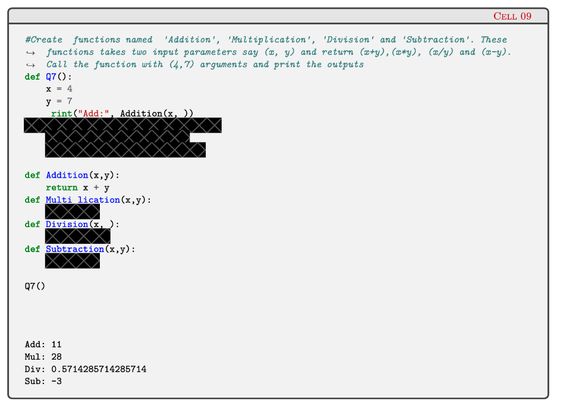
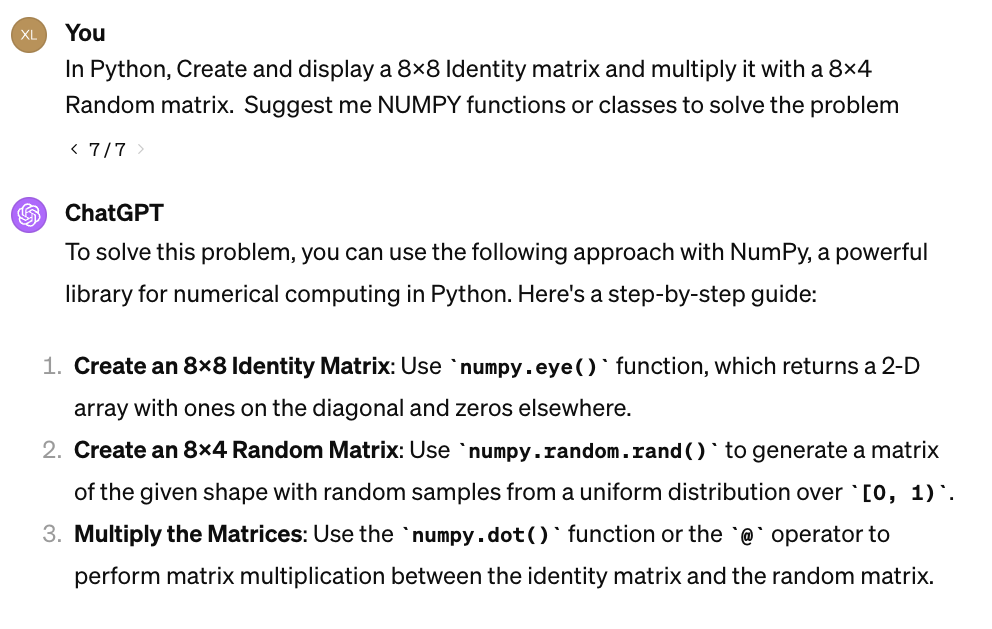

## Workshop Objectives 
* Help you PASS this unit and Push qualified students to higher scores
* Very Personally, I want you to ENJOY each workshop as a journey learning something NEW
  * Understand Underlying Math and The Use of ML Algorithms
      > I know math is boring to follow. Try to prepare by looking at the materials before workshop and IMMEDIATELY interrupt me if I lose you.
      <!-- Math is sometimes more strict and concise than human language. If you do not understand after I explained it, it must be due to my poor ability of explaining them. Feel free to ASK me on the workshops. -->
  * Implement Typical ML Algorithms Using Python 
  <!-- from Scratch Rather Than Just Use High-level API
    * Suggest using CoPilot for real-time code completion in this course
    * Use ChatGPT for code generation if you know the exact steps of algorithms for your benefit, otherwise, the generated code would be rubbish
    * But feel free to generate rubbish for unimportant parts like visualization since this course wants to train you as ML EXPERTS rather than design experts
    *  -->

## Assignments
* **Garding for OnTrack Tasks**: The OnTrack tasks only determin the range of your scores: P, C, D, HD. For all these tasks, including the weekly PASS tasks and those categorized under C, D, HD, you will receive either a "PASS" or "NOT PASS" without specific grades. Specific grades will be determined only at the end of the trimester. 

* Submissions
  * **Summary Report**: This is primarily for your benefit. I just need to confirm your engagement with the materials we provided to you (t blog posts, codes, books or papers we introduced in CloudDeakin and [here](https://github.com/xinzhel/learn-machine-learning/blob/main/README.md)). 

  ```
  1.1. Summarise the main points that are covered in this week. 
  1.2. Provide summary of your reading list – external resources, websites, book 
  chapters, code libraries, etc.
  1.3. Reflect on the knowledge that you have gained by reading contents of this week 
  with respect to machine learning
  1.4. Attempt the quiz given in weekly content (5.18) and add screenshot of your score (>85% is considered completion of this task) in this report
  ```
  * **Coding Assignments**: These will be my primary focus, especially evaluating the accuracy of your solution logic for each coding task. Your clear presentation will facilitate the grading process.
Coding Assignment Format: Below is an example format. Notice how each question is encapsulated in a separate Python function, e.g., def Q7; and rather than consolidating all code within Q7, break it down into modular functions, e.g., Addition, Multiplication for Q7.
  
* Using ChatGPT-like Generative AI Tools
  * According to[Deakin Guidelines](https://blogs.deakin.edu.au/deakinlife/2023/02/02/what-you-need-to-know-about-chatgpt-and-other-ai-tools/#:~:text=Make%20sure%20that%20the%20final,work%2C%20creation%2C%20and%20analysis), "Make sure that the final product is your own work, and not just copied from an AI generator. You can use the generated text as a prompt for inspiration or guidance, but the final submitted assessment must be your work, creation, and analysis."
  * So one easy way for using ChatGPT is to let it generate relevant classes and functions for you to sovle the problems, as shown below.
  
  
  
## Workshop Materials
Most of the workshop materials are made by myself because I want to give you 
* A life-time journey to ML: they are permantly published and continuously updated, which means that you can easily jog your memory online in your whole career.

* A EASY, COHERENT journey to ML
  *  They save more time compared to delving into an extensive textbook (if you have the time, consider exploring [the foundational book of ML](https://www.microsoft.com/en-us/research/uploads/prod/2006/01/Bishop-Pattern-Recognition-and-Machine-Learning-2006.pdf)), and they provide a clearer understanding than the original materials available on CloudDeakin (I also review the CloudDeakin content to ensure alignment with this course). 
  *  Specifically, I've created a page that outlines the workshop structure and includes links to all relevant code snippets and detailed materials, organized according to the sequence of the topics I will introduce in the workshop. You can access it here: [outline page](https://github.com/xinzhel/learn-machine-learning/blob/main/README.md).
<!-- * they are more comprehensive. You will learn more than expected for PASSing this course is not enough for me as a tutor, I want to prepare you as a knowledgeable ML engineer. 
> Sometimes, I may lose you. Remind me please. -->

> Currently, it holds the materials from my workshops last year. I encourage you to keep an eye on the page, as I regularly develop and update it with high-quality content. Should you encounter any issues or have suggestions for improvements, please feel free to DM me or leave comments on my blog posts or submit a pull request.


## When to Contact Me? How to Contact Me?
* **Email the Unit Chair and lecturer** or **Team-message** for any question after the workshop
* When to CONTACT me?
  * ONLY leave me messages on OnTrack for the grading issues.
    * If I do not repond to you in 4 days or it is VERY EMERGENT, send a Team-message to xinzhe.li@deakin.edu.au.
* How to CONTACT me?
  <!-- * Workshops at Burwood: Wed 13:00-14:50 Burwood LC5.105; Wed 16:00-17:50 LC2.100
  * [Online Workshop](https://teams.microsoft.com/l/message/19:a2a4a88a0b52481fb158d02901417913@thread.tacv2/1709172461138?tenantId=d02378ec-1688-46d5-8540-1c28b5f470f6&groupId=bdeccde9-d8bd-424e-9c17-bd5e2c198d8d&parentMessageId=1709172461138&teamName=SIT307-SIT720%20Machine%20Learning%20T1%202024&channelName=SIT307_SIT720_OnlineWorkshop_Thur_6pm_7.50pm&createdTime=1709172461138): Thu 18:00-19:50  -->
  * Online Helphub session ([The link](https://teams.microsoft.com/l/meetup-join/19:33c1111d96654650bd2fb52943701d25@thread.tacv2/1709789549124?context=%7B%22Tid%22:%22d02378ec-1688-46d5-8540-1c28b5f470f6%22,%22Oid%22:%224ba13cd8-3d96-4211-a014-6ad747495e5a%22%7D) will be given soom): Thu 17:00pm-18:00pm
  * During/After this trimester: Leave comments under my blog post or make a pull request on Github for technical issues. (Do not report the errors of CloudDeakin to me.)

<!-- * [See Unit Guide](https://apps.deakin.edu.au/current-students-unitguides/UnitGuide.php?service_cd=I&unit=SIT720&year=2023&semester=TRI-1#0-UNIT-CHAIR-TABLE) -->

<!-- https://deakin365-my.sharepoint.com/personal/m_liu_deakin_edu_au/_layouts/15/onedrive.aspx?csf=1&web=1&e=MFKEWI&cid=2f6034de-6c1b-430d-8e13-557421220221&id=%2Fpersonal%2Fm_liu_deakin_edu_au%2FDocuments%2FSIT720%2F2024T1_SIT307_720&FolderCTID=0x0120000B6486C66F26E44AB22A8CF7E77397B8&view=0 -->


